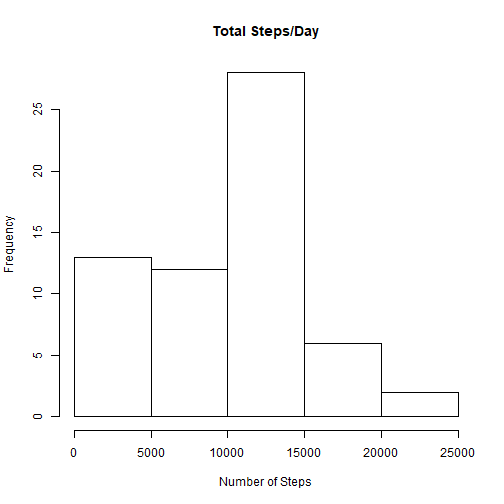
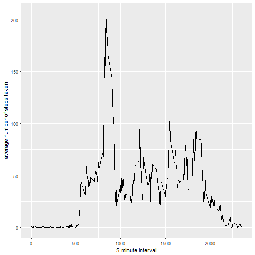
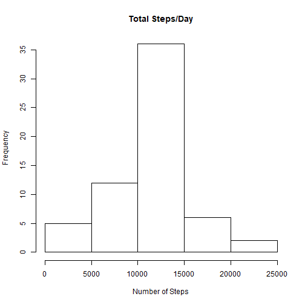
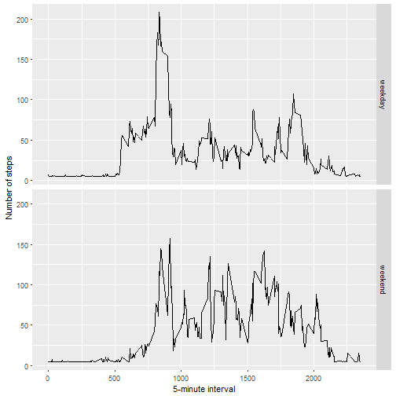

# Reproducible Research: Project 1
---
title: "Reproducible Research: Peer Assessment 1"
output: 
  html_document:
    keep_md: true
---


## Loading and preprocessing the data


```r
if(!file.exists('activity.csv')){
    unzip('activity.zip')
}
activityData <- read.csv('activity.csv')
```

## What is mean total number of steps taken per day?

##### 1. The total number of steps taken per day


```r
totalStepsByDay <- tapply(activityData$steps, activityData$date, sum, na.rm=TRUE)
```


##### 2.  A histogram of the total number of steps taken each day


```r
library(ggplot2)
hist(totalStepsByDay, main = "Total Steps/Day", xlab="Number of Steps")
```



##### 3.  The mean and median of the total number of steps taken per day


```r
mean(totalStepsByDay, na.rm=TRUE)
```

```
## [1] 9354.23
```

```r
median(totalStepsByDay, na.rm=TRUE)
```

```
## [1] 10395
```


## What is the average daily activity pattern?

##### 1.  A time series plot of the 5-minute interval (x-axis) and the average number of steps taken, averaged across all days (y-axis)


```r
averages <- aggregate(x=list(steps=activityData$steps), by=list(interval=activityData$interval),
                      FUN=mean, na.rm=TRUE)
ggplot(data=averages, aes(x=interval, y=steps)) +
    geom_line() +
    xlab("5-minute interval") +
    ylab("average number of steps taken")
```



##### 2.  The 5-minute interval the contains maximum number of Step, actoss all the days in the dataset: 


```r
averages[which.max(averages$steps),]
```

```
##     interval    steps
## 104      835 206.1698
```

## Imputing missing values

##### 1. The total number of missing values in the dataset


```r
missing <- sum(is.na(activityData$steps))
```

##### 2. Fill Missing Values 

The missing values would be filled with the mean steps per day

##### 3. A New dataset that is equal to the original dataset but with the missing data filled in.


```r
library(Hmisc)

activityDataImputed <- activityData
activityDataImputed$steps <- impute(activityData$steps, fun=mean)
```

##### 4. A histogram of the total number of steps taken each day and Calculate and report the mean and median total number of steps taken per day. 


```r
totalStepsByDay <- tapply(activityDataImputed$steps, activityDataImputed$date, FUN=sum)
hist(totalStepsByDay, main = "Total Steps/Day", xlab="Number of Steps")
```



```r
mean(totalStepsByDay)
```

```
## [1] 10766.19
```

```r
median(totalStepsByDay)
```

```
## [1] 10766.19
```


## Are there differences in activity patterns between weekdays and weekends?


##### 1. Add factor with two levels - "weekday"and ""weekend" to indicate whether a date is wekend or not to the dataset


```r
activityDataImputed$dateType <-  ifelse((weekdays(as.Date(activityDataImputed$date)) %in% c("Saturday","Sunday")),  'weekend', 'weekday')
```

##### 2. A panel plot containing  of the 5-minute interval (x-axis) and the average number of steps taken, averaged across all weekday days or weekend days (y-axis). 


```r
averages <- aggregate(steps ~ interval + dateType, data=activityDataImputed, mean)
ggplot(averages, aes(interval, steps)) + geom_line() + facet_grid(dateType ~ .) +
    xlab("5-minute interval") + ylab("Number of steps")
```


